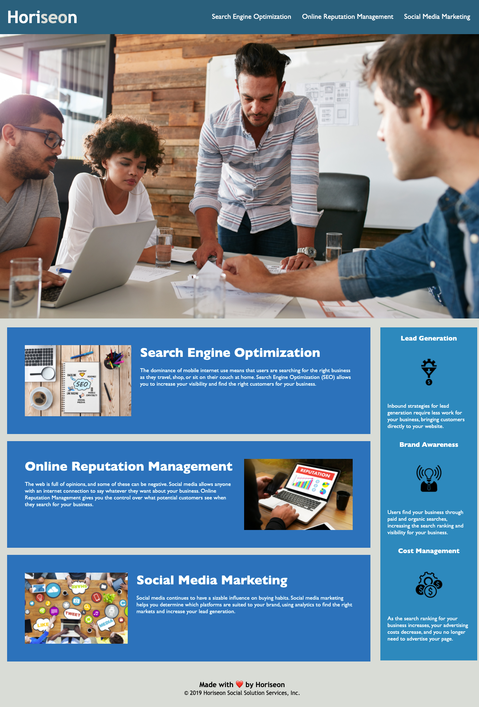

# Unit 01 HW: code-refactor-for-client

## Description
This project refactors the existing code of the Horiseon website. 
A client has hired me as a web developer to refactor an existing site to make it more accesible without making any functionality changes.
As a web developer, I have implemented a new technology to optimize an existing code by meeting the criteria that has been provided by the client.

## Tasks Assigned

```
A client, Horiseon, wanted a codebase that follows accessibility standards 
such that their website is optimized for search engines.
Thus, I was asked to complete the following tasks:
```
- The source code follows the semantic HTML elements
- The structure of the HTML elements follow a logical structure independent of styling and posistioning
- The image elements have appropriate alt attributes
- The heading attributes fall in sequential order
- The title elements are concise and well descriptive

## Tasks Completed

```
As a web developer,
The following tasks were completed to meet the client's criteria:
```
- [x] __HTML elements__ have been organized and replaced with __semantic HTML elements__
- [x] Organized elements, classes, and id properly
- [x] __Alt attributes__ were added to the images
- [x] Heading elements were used properly named and they fall in __sequential order__
- [x] A __concise and decriptive titles__ have been used
- [x] Added comments in HTML and CSS to assist analyzing the code
- [x] Optimized redundant codes in CSS for better accessiblity

## Screenshot of the Website



## Links

Deployed Website Link: [https://rhwlffk1028.github.io/code-refactoring-for-client/](https://rhwlffk1028.github.io/code-refactoring-for-client/)

Code Repository Link: [https://github.com/rhwlffk1028/code-refactoring-for-client/](https://github.com/rhwlffk1028/code-refactoring-for-client/)

> **Note**: Use the first link above to access the website. By clicking the deployed webiste link, you will be directed to the web browser and it will be viewable.<br>
> **Note**: Use the second link above to access the repository where the html, css, and image files are live.

## Copyright
---
Copyright (c) [2021] [Jun Choi] <br>
Confidential and Proprietary. All Rights Reserved.